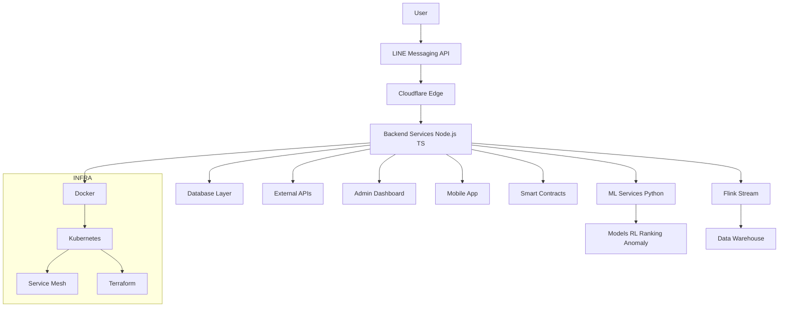

# 🚀 zLinebot

### AI-Native Super Platform for Messaging, Intelligence, and Distributed Systems
**From LINE Bot → AI → ML → Data → Web3 → Cloud Infrastructure (All-in-One Ecosystem)**

---

<p align="center">
  
  
  
  
  
  
  
  
  
</p>

---

> **zLinebot is not just a chatbot.**
> It is a **full-stack AI-native platform** that unifies messaging, machine learning, data infrastructure, and cloud systems into one scalable architecture.

---

## ⚡ Executive Summary

zLinebot is designed as an **AI-first distributed system**:
- LINE is the user interaction surface.
- Backend services orchestrate workflows and APIs.
- ML services power ranking, personalization, and automation.
- Cloud-native infrastructure enables scale and reliability.

---

## 🧠 ภาพรวมระบบ

zLinebot คือแพลตฟอร์ม AI แบบ Full-stack ที่รวม:

- 🤖 LINE Bot (Frontend Interface)
- ⚙️ Backend (Node.js + TypeScript)
- 🧠 Machine Learning (Python)
- 📊 Data Platform (SQL + Feature Store + Warehouse)
- 🌐 Cloud-native Infrastructure (Docker, Kubernetes, Cloudflare)
- ⛓ Web3 (Smart Contracts)

---

## 🏗 System Architecture

> Mermaid ด้านล่างปรับให้เป็น GitHub-safe syntax (text-only labels) เพื่อเลี่ยง parse error.



---

## 🛠 Technology Stack

### Backend
- Node.js (TypeScript) → `app/`
- Cloudflare Workers → `cloudflare/`

### Frontend
- Admin Dashboard (Vite/React) → `admin/`
- Mobile App (React Native) → `mobile/`

### AI / ML
- Python ML services → `ml/`
- RL, ranking, federated learning, explainability

### Data
- SQL schemas → `db/`
- Warehouse assets → `warehouse/`
- Stream processing jobs → `flink/`

### Infrastructure
- Docker / Compose → `docker/`
- Kubernetes manifests → `k8s/`
- Terraform → `infra/`
- Nginx gateway → `nginx/`

### Web3
- Solidity contracts → `contracts/`

---

## 📁 Project Structure

```text
zLinebot/
├── app/            # Backend services (Node.js / TS)
├── admin/          # Dashboard (Vite/React)
├── mobile/         # Mobile app (React Native)
├── ml/             # AI / ML pipelines
├── db/             # Database schemas
├── warehouse/      # Analytics warehouse
├── flink/          # Stream processing
├── contracts/      # Smart contracts
├── cloudflare/     # Edge workers
├── cloud/          # Worker services
├── docker/         # Containers
├── k8s/            # Kubernetes
├── infra/          # Terraform
├── scripts/        # Automation
├── docs/           # Documentation
└── nginx/          # Gateway
```

---

## ⚡ Key Capabilities

- Intelligent LINE chatbot interface
- AI-driven personalization and decision systems
- Distributed microservices backend
- Edge-to-cloud execution model
- Real-time and batch data processing
- Privacy-first ML direction
- Web3 integration layer

---

## 🎯 Use Cases

- LINE AI Chatbot
- Recommendation System
- Automation Platform
- AI SaaS
- Web3 + AI Integration

---

## 🚀 Deployment Options

- Local development (Docker Compose)
- Cloud deployment (Fly.io / Cloudflare)
- Kubernetes cluster (production scale)
- Edge deployment (Cloudflare Workers)

---

## 🔮 Roadmap

- LLM / AI Agent integration
- Real-time personalization
- Privacy-preserving AI (federated + FHE-ready)
- Multi-region distributed deployment
- Tokenized AI ecosystem

---

## 🤝 Contributing

Contributions are welcome across backend, ML, infrastructure, and docs.

- Contribution guide: `docs/CONTRIBUTING_th.md`
- Security policy: `SECURITY.md`

---

## 📄 License

MIT License

---

## 🌍 Vision

> Build an AI-native infrastructure layer where messaging, intelligence, and distributed systems converge into one platform.
